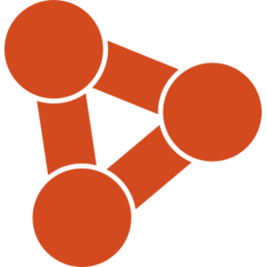

# Browser Bridge

  

A local bridge between your coding agent and a real Chrome tab. Browser Bridge gives the agent structured access to DOM, styles, layout, console, network, and reversible patches - starting from the actual tab you already have open, with all its real state intact.

See [Quick Start](./docs/QUICKSTART.md) to get started in another repo.

## Supported Agents

Managed CLI skill installs support OpenAI Codex, Claude Code, Cursor, GitHub Copilot, OpenCode, Antigravity, and Windsurf.

Generic agents can connect via MCP or the CLI skill interface, but would need a manual setup.

<table align="center">
  <tr>
    <td align="center" width="140">
      <a href="https://openai.com/codex/">
        <picture>
          <source media="(prefers-color-scheme: dark)" srcset="https://unpkg.com/@lobehub/icons-static-png@latest/dark/codex.png" />
          
        </picture>
      </a>
    </td>
    <td align="center" width="140">
      <a href="https://claude.com/product/claude-code">
        <picture>
          <source media="(prefers-color-scheme: dark)" srcset="https://unpkg.com/@lobehub/icons-static-png@latest/dark/claude.png" />
          
        </picture>
      </a>
    </td>
    <td align="center" width="140">
      <a href="https://cursor.com/">
        <picture>
          <source media="(prefers-color-scheme: dark)" srcset="https://unpkg.com/@lobehub/icons-static-png@latest/dark/cursor.png" />
          
        </picture>
      </a>
    </td>
    <td align="center" width="140">
      <a href="https://github.com/features/copilot">
        <picture>
          <source media="(prefers-color-scheme: dark)" srcset="https://unpkg.com/@lobehub/icons-static-png@latest/dark/githubcopilot.png" />
          
        </picture>
      </a>
    </td>
  </tr>
  <tr>
    <td align="center">OpenAI Codex</td>
    <td align="center">Claude Code</td>
    <td align="center">Cursor</td>
    <td align="center">GitHub Copilot</td>
  </tr>
  <tr>
    <td align="center" width="140">
      <a href="https://opencode.ai/">
        <picture>
          <source media="(prefers-color-scheme: dark)" srcset="https://unpkg.com/@lobehub/icons-static-png@latest/dark/opencode.png" />
          
        </picture>
      </a>
    </td>
    <td align="center" width="140">
      <a href="https://antigravity.google/">
        <picture>
          <source media="(prefers-color-scheme: dark)" srcset="https://unpkg.com/@lobehub/icons-static-png@latest/dark/antigravity.png" />
          
        </picture>
      </a>
    </td>
    <td align="center" width="140">
      <a href="https://windsurf.com/">
        <picture>
          <source media="(prefers-color-scheme: dark)" srcset="https://unpkg.com/@lobehub/icons-static-png@latest/dark/windsurf.png" />
          
        </picture>
      </a>
    </td>
    <td align="center" width="140">
      <code>.agents</code>
    </td>
  </tr>
  <tr>
    <td align="center">OpenCode</td>
    <td align="center">Antigravity</td>
    <td align="center">Windsurf</td>
    <td align="center">Generic agents</td>
  </tr>
</table>

## What it's for

- Debugging a UI on `localhost`: read DOM, computed styles, layout, console logs, and network state without a screenshot
- Verifying a code change actually rendered the expected result in Chrome
- Patching the live page to prove a fix visually, then moving it into source and rolling the patch back
- Running structured browser checks from any local agent or IDE, not just one AI product

## Why Browser Bridge

Most adjacent tools optimize for different goals. [Playwright](https://playwright.dev/) and headless automation stacks are excellent for deterministic tests and CI - but they start from a clean browser context by design. [Claude in Chrome](https://support.claude.com/en/articles/12012173-get-started-with-claude-in-chrome) is great for integrated Claude workflows, but is vendor-specific. Generic MCP browser servers offer broad control without the developer-focused depth.

Browser Bridge is optimized for the opposite starting point: **inspect the state that already exists** in a real tab - logged-in sessions, feature flags, seeded storage, SPA state - use structured reads to understand it, test a patch in place, then fix the source. It's open-source, agent-agnostic, and scoped to explicit tab sessions rather than ambient browser control.

## Setup

1. Install [Browser Bridge from the Chrome Web Store](https://chrome.google.com/webstore/detail/ahhmghheecmambjebhfjkngdggghbkno) <!-- TODO: replace with final store link after publishing -->
2. `npm install -g @browserbridge/bbx` - installs the CLI and native host
3. In the extension side panel, install MCP or CLI (skill) for your agent of choice, or run the `bbx install-mcp` / `bbx install-skill` commands if you prefer terminal setup
4. Enable Browser Bridge for the Chrome window you want to inspect/control with the AI agent
5. Ask your agent to use Browser Bridge via MCP (`BB MCP` or `Browser Bridge MCP`), or invoke the `browser-bridge` / `$bbx` skill in CLI mode

## How it works

- The extension is scoped to one explicitly enabled Chrome window at a time - no ambient browser access
- Requests default to the active tab in that window unless a tab is targeted explicitly
- Sessions are tab and origin scoped, auto-refreshed when possible
- All patch operations are reversible and session-scoped
- Structured DOM/style/layout reads are the primary transport; screenshots are a fallback
- The native host daemon auto-starts on demand

## Privacy

Browser Bridge itself routes extension data locally through the Chrome extension, native host, and the local client you choose to connect. Browser Bridge does not operate a Browser Bridge cloud service.

Your connected agent or IDE may still forward tool calls or tool results to remote services under that product's own settings and privacy policy. See [PRIVACY.md](./PRIVACY.md) for the Browser Bridge policy.

## License

MIT. See [LICENSE](LICENSE).
